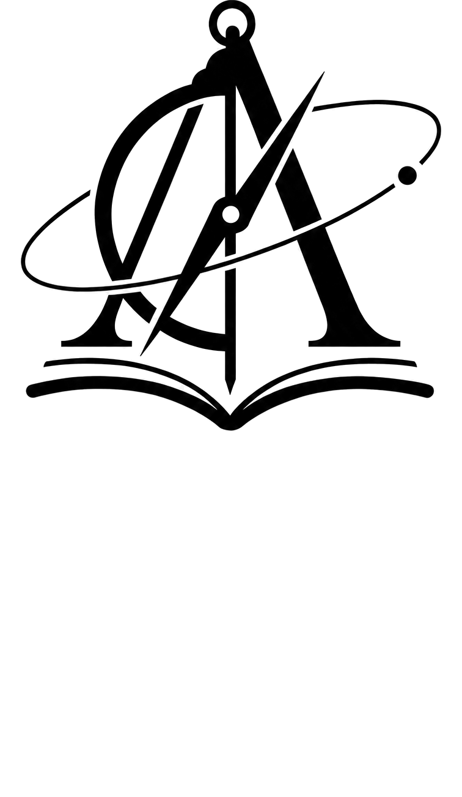

# Ars  Astronomica

A scholarly imprint producing first English translations of historical Hebrew and Latin works in astronomy, cosmology, and natural philosophy.

These texts span centuries, and most have never appeared in English. One -- Gersonides' 136-chapter mathematical astronomy -- was never printed and survives only in manuscript. They cite and answer one another, addressing the same cosmological questions, yet until now no one could read them side by side in a single language.

## The corpus

| Date | Author | Work | Source | Description | Translator Version |
| -------- | ---------------------------- | -------------------------------------------------------------------------------------------------------------------------------------------------------------------------------------------------- | ----------------------------------------------------------------------------------------- | --------------------------------------------------------------------------------------------------------------------------------------------------------------------------------------------------------------- | ------------------ |
| 1665 | Athanasius Kircher | [*Mundus Subterraneus*](https://arsastronomica.us-southeast-1.linodeobjects.com/Athanasius_Kircher_Mundus_Subterraneus.pdf) [footnotes](https://arsastronomica.us-southeast-1.linodeobjects.com/Athanasius_Kircher_Mundus_Subterraneus_Footnotes.pdf) | [Internet Archive](https://archive.org/details/athanasiikircher12kirc) | A vast attempt to explain the whole hidden world beneath our feet. | 2 |
| c. 1613 | David Gans | [*Nechmad ve-Na'im*](https://arsastronomica.us-southeast-1.linodeobjects.com/David_Gans_Nechmad_ve-Naim.pdf) [footnotes](https://arsastronomica.us-southeast-1.linodeobjects.com/David_Gans_Nechmad_ve-Naim_Footnotes.pdf) | [HebrewBooks.org ID 20763](https://hebrewbooks.org/20763) | A Hebrew textbook of astronomy that presents the Ptolemaic model of the heavens for a Hebrew-reading audience, weaving the cutting-edge European science of its day together with the medieval Jewish cosmological tradition — its author having personally visited the Danish astronomer Tycho Brahe. | 2 |
| 1665 | Giovanni Battista Riccioli | [*Astronomia Reformata*](https://arsastronomica.us-southeast-1.linodeobjects.com/Giovanni_Battista_Riccioli_Astronomia_Reformata.pdf) [footnotes](https://arsastronomica.us-southeast-1.linodeobjects.com/Giovanni_Battista_Riccioli_Astronomia_Reformata_Footnotes.pdf) | [e-rara, ETH-Bibliothek Zürich](https://www.e-rara.ch/zut/content/titleinfo/141744) | A mature reckoning with the heavens as the telescope was revealing them — a sequel to the vast *Almagestum Novum* (1651), built on further years of observation at Bologna with the collaborator Grimaldi, with fresh measurements and corrected parameters at center stage. | 2 |
| 1629 | Joseph Solomon Delmedigo | [*Sefer Elim*](https://arsastronomica.us-southeast-1.linodeobjects.com/Joseph_Solomon_Delmedigo_Sefer_Elim.pdf) [footnotes](https://arsastronomica.us-southeast-1.linodeobjects.com/Joseph_Solomon_Delmedigo_Sefer_Elim_Footnotes.pdf) | [Internet Archive University of Toronto / Gerstein scan; OCLC AGY-5454, ID `seferelim00delmuoft`](https://archive.org/details/seferelim00delmuoft) | A wide-ranging Hebrew scientific compendium, framed as a reply to questions put by the Karaite scholar Zerah ben Nathan. | 2 |
| 1640 | Longomontanus | [*Astronomia Danica*](https://arsastronomica.us-southeast-1.linodeobjects.com/Longomontanus_Astronomia_Danica.pdf) [footnotes](https://arsastronomica.us-southeast-1.linodeobjects.com/Longomontanus_Astronomia_Danica_Footnotes.pdf) | [Internet Archive](https://archive.org/details/astronomiadanica00long) | A comprehensive textbook of astronomy and the definitive technical account of the Tychonic system — Earth at rest, the Sun circling it, the planets circling the Sun. | 2 |
| 1654 | Pierre Gassendi | [*Tychonis Brahei Vita*](https://arsastronomica.us-southeast-1.linodeobjects.com/Pierre_Gassendi_Tychonis_Brahei_Vita.pdf) [footnotes](https://arsastronomica.us-southeast-1.linodeobjects.com/Pierre_Gassendi_Tychonis_Brahei_Vita_Footnotes.pdf) | [Internet Archive — original held by Det Kongelige Bibliotek Royal Library, Copenhagen](https://archive.org/details/den-kbd-pil-130018157889-001/) | A life of the Danish astronomer Tycho Brahe (1546–1601): his fabled observatory on the island of Hven, the magnificent instruments he built, the campaigns of observation that remade astronomy, his bold model of the cosmos, and his turbulent final years in Prague. | 2 |
| c. 1136 | R. Avraham bar Ḥiyya ha-Nasi | [*Po'al ha-Shem ve-Cheshbon Mahalechot ha-Kochavim*](https://arsastronomica.us-southeast-1.linodeobjects.com/Avraham_bar_Hiyya_ha-Nasi_Poal_ha-Shem_ve-Cheshbon_Mahalechot_ha-Kochavim.pdf) [footnotes](https://arsastronomica.us-southeast-1.linodeobjects.com/Avraham_bar_Hiyya_ha-Nasi_Poal_ha-Shem_ve-Cheshbon_Mahalechot_ha-Kochavim_Footnotes.pdf) | [HebrewBooks.org ID 22072 (NNL-001075515; OCLC 232940278)](https://hebrewbooks.org/22072) | A medieval Hebrew treatise on mathematical astronomy and the computation of the Jewish calendar. | 2 |
| c. 1122 | R. Avraham bar Ḥiyya ha-Nasi | [*Sefer HaIbbur*](https://arsastronomica.us-southeast-1.linodeobjects.com/Avraham_bar_Hiyya_ha-Nasi_Sefer_HaIbbur.pdf) [footnotes](https://arsastronomica.us-southeast-1.linodeobjects.com/Avraham_bar_Hiyya_ha-Nasi_Sefer_HaIbbur_Footnotes.pdf) | [HebrewBooks.org ID 21292](https://hebrewbooks.org/21292) | The earliest systematic Hebrew treatise on the science of the calendar, written in early-twelfth-century Barcelona. | 2 |
| c. 1132 | R. Avraham bar Ḥiyya ha-Nasi | [*Sefer Tsurat ha-Arets*](https://arsastronomica.us-southeast-1.linodeobjects.com/Avraham_bar_Hiyya_ha-Nasi_Sefer_Tsurat_ha-Arets.pdf) [footnotes](https://arsastronomica.us-southeast-1.linodeobjects.com/Avraham_bar_Hiyya_ha-Nasi_Sefer_Tsurat_ha-Arets_Footnotes.pdf) | [NYPL Digital Collections, Dorot Jewish Division](https://digitalcollections.nypl.org/items/ce668260-c766-0132-045a-58d385a7b928) | A foundational work of medieval cosmology that lays out the shape of the cosmos as the Greeks and their Arabic heirs understood it: a spherical earth at the center of nested celestial spheres, the paths of sun and moon, and the zones and geography of the inhabited world. | 2 |
| c. 1148 | R. Avraham ibn Ezra | [*Keli ha-Nechoshet*](https://arsastronomica.us-southeast-1.linodeobjects.com/Avraham_ibn_Ezra_Keli_ha-Nechoshet.pdf) [footnotes](https://arsastronomica.us-southeast-1.linodeobjects.com/Avraham_ibn_Ezra_Keli_ha-Nechoshet_Footnotes.pdf) | [HebrewBooks.org ID 20850 — direct PDF at <>](https://hebrewbooks.org/pdf.aspx?req=20850) | The earliest surviving Hebrew treatise on the astrolabe, composed in the mid-twelfth century. | 2 |
| c. 1500 | R. Eliyahu Mizrahi | [*Kitsur ha-Melakhat ha-Mispar*](https://arsastronomica.us-southeast-1.linodeobjects.com/Eliyahu_Mizrahi_Kitsur_ha-Melakhat_ha-Mispar.pdf) [footnotes](https://arsastronomica.us-southeast-1.linodeobjects.com/Eliyahu_Mizrahi_Kitsur_ha-Melakhat_ha-Mispar_Footnotes.pdf) | [NYPL Digital Collections, Dorot Jewish Division](https://digitalcollections.nypl.org/items/ce668260-c766-0132-045a-58d385a7b928) | Kitsur ha-Melakhat ha-Mispar ("Compendium of the Art of Number") is a Hebrew arithmetic textbook by Rabbi Eliyahu Mizrahi (ca. 1455–1526), the chief rabbi of the Ottoman Empire and one of the foremost Jewish mathematicians of his age. | 2 |
| c. 1365 | R. Immanuel Bonfils | [*Shesh Kenafayim*](https://arsastronomica.us-southeast-1.linodeobjects.com/Immanuel_Bonfils_Shesh_Kenafayim.pdf) [footnotes](https://arsastronomica.us-southeast-1.linodeobjects.com/Immanuel_Bonfils_Shesh_Kenafayim_Footnotes.pdf) | [University of Pennsylvania Kislak Center for Special Collections, LJS 204; Digital Scriptorium DS129; digitized by UPenn Libraries via Colenda / OPenn](https://search.digital-scriptorium.org/catalog/DS129) | One of the most widely copied Hebrew astronomical handbooks of the late Middle Ages, composed around 1365 in Provence. | 2 |
| c. 1328 | R. Levi ben Gershom | [*Sefer HaTechunah*](https://arsastronomica.us-southeast-1.linodeobjects.com/Levi_ben_Gershom_Sefer_HaTechunah.pdf) [footnotes](https://arsastronomica.us-southeast-1.linodeobjects.com/Levi_ben_Gershom_Sefer_HaTechunah_Footnotes.pdf) | [Gallica / Ktiv project BnF; digitized in cooperation with the National Library of Israel and the Friedberg Jewish Manuscript Society](https://gallica.bnf.fr/ark:/12148/btv1b10544205n) | A complete medieval system of mathematical astronomy, formally Book V, Part 1 of the *Wars of the Lord*. | 2 |
| c. 1310 | R. Yitzchak Yisraeli | [*Yesod Olam*](https://arsastronomica.us-southeast-1.linodeobjects.com/Yitzchak_Yisraeli_Yesod_Olam.pdf) [footnotes](https://arsastronomica.us-southeast-1.linodeobjects.com/Yitzchak_Yisraeli_Yesod_Olam_Footnotes.pdf) | [Digital Bodleian, Bodleian Libraries, University of Oxford](https://digital.bodleian.ox.ac.uk/objects/aa14af19-443e-4f76-99da-7f3a4cd067a0/) | One of the great medieval Hebrew treatises on astronomy and the science of the Jewish calendar, composed in Toledo in the first half of the fourteenth century. | 2 |
| 1602 | Tycho Brahe | [*Astronomiae Instauratae Mechanica*](https://arsastronomica.us-southeast-1.linodeobjects.com/Tycho_Brahe_Astronomiae_Instauratae_Mechanica.pdf) [footnotes](https://arsastronomica.us-southeast-1.linodeobjects.com/Tycho_Brahe_Astronomiae_Instauratae_Mechanica_Footnotes.pdf) | [Internet Archive — Getty Research Institute copy](https://archive.org/details/gri_tychonisbrah00brah) | A sumptuously illustrated catalog of the most accurate astronomical instruments built before the telescope, gathered on the island observatory of Hven. | 2 |
| 1610 | Tycho Brahe | [*Astronomiae Instauratae Progymnasmata*](https://arsastronomica.us-southeast-1.linodeobjects.com/Tycho_Brahe_Astronomiae_Instauratae_Progymnasmata.pdf) [footnotes](https://arsastronomica.us-southeast-1.linodeobjects.com/Tycho_Brahe_Astronomiae_Instauratae_Progymnasmata_Footnotes.pdf) | [e-rara / ETH-Bibliothek Zürich, shelfmark Rar 4153 — DOI 10.3931/e-rara-315, e-rara object ID 84169](https://www.e-rara.ch/zut/doi/10.3931/e-rara-315) | The fullest statement of the observational program that transformed the science of the heavens. | 2 |
| 1588 | Tycho Brahe | [*De Mundi Aetherei Recentioribus Phaenomenis*](https://arsastronomica.us-southeast-1.linodeobjects.com/Tycho_Brahe_De_Mundi_Aetherei_Recentioribus_Phaenomenis.pdf) [footnotes](https://arsastronomica.us-southeast-1.linodeobjects.com/Tycho_Brahe_De_Mundi_Aetherei_Recentioribus_Phaenomenis_Footnotes.pdf) | [Internet Archive — Google Books scan](https://archive.org/details/bub_gb_2f-EqKxRN34C) | When a brilliant comet blazed across Europe in 1577, the finest instruments of the age were turned upon it, and the measurements shattered the ancient belief in unchanging, perfect heavens: the comet moved freely where solid crystalline spheres were supposed to be. | 2 |
| 1596 | Tycho Brahe | [*Epistolarum Astronomicarum Libri*](https://arsastronomica.us-southeast-1.linodeobjects.com/Tycho_Brahe_Epistolarum_Astronomicarum_Libri.pdf) [footnotes](https://arsastronomica.us-southeast-1.linodeobjects.com/Tycho_Brahe_Epistolarum_Astronomicarum_Libri_Footnotes.pdf) | [Internet Archive](https://archive.org/details/tychonisbrahedan00brah) | Before scientific journals existed, astronomers argued, boasted, and traded discoveries by letter. | 2 |
| c. 150–850 CE | Unknown | [*Mishnat ha-Middot*](https://arsastronomica.us-southeast-1.linodeobjects.com/Unknown_Mishnat_ha-Middot.pdf) [footnotes](https://arsastronomica.us-southeast-1.linodeobjects.com/Unknown_Mishnat_ha-Middot_Footnotes.pdf) | [HebrewBooks.org ID 39044 (Chabad-Lubavitch Library copy; bound with *Pachad Yitzchak*, letter פ"א)](https://hebrewbooks.org/39044) | The earliest known Hebrew treatise on geometry — a concise practical manual of mensuration covering the areas and perimeters of plane figures, the measurement of circles and segments, and an early value for π. | 2 |

## Updates

**2026-06-29**

- All translations are now at **version 2**, regenerated with the corrected pipeline. Version 1 turned out to be an intermediate stage and has been superseded.
- Added new works to the corpus -- most recently *Sefer Tsurat ha-Arets*, *Kitsur ha-Melakhat ha-Mispar*, and *Sefer Elim*.
- Draft editorial footnotes are now available for download from a **footnotes** link beneath each work's title.

## About the translations

Translations are produced with an automated, AI-assisted pipeline that runs each text through a multi-stage workflow before final collation. For technical details, see the translator's [translation-pipeline](https://github.com/sweisman/translation-pipeline) repo.

These translations are prepublication texts -- nearly publication-ready, pending the diagrams and illustrations still in progress.

The goal is fluent, readable modern English -- a text an educated reader can follow without reaching for the Latin or Hebrew, not one written only for specialists. Rather than reproduce the long periodic sentences and deferred verbs of the originals, the translations carry the author's meaning, argument, and tone into natural contemporary prose: where Tycho builds a single sentence whose main verb arrives only after four nested clauses, the translation breaks it into the two or three a modern writer would use. Fidelity comes first, though -- nothing is dropped, summarized, or invented, and negations, numbers, technical terms, and the author's own examples and analogies are preserved exactly. Readability never comes at the cost of changing what the source says.

Technical vocabulary stays precise and is anchored to its modern equivalents. A key Latin or Hebrew term of art is glossed on its first occurrence -- the original shown alongside the English rendering -- and thereafter carried in settled English. Historical names, star names, and specialized vocabulary carry inline identifications: Tycho's "Lucida Vulturis volantis" is identified as Altair in Aquila; Gersonides' medieval Hebrew astronomical terminology is mapped to the Ptolemaic system it describes.

Mathematical and astronomical content -- sexagesimal values, spherical triangle computations, calendar arithmetic, tabular data -- is reproduced with the precision of the originals, cell by cell and degree by degree. Compositor errors in the source are corrected inline with `[recte: ...]` notation rather than silently emended. Uncertain readings due to ink damage, worn type, or ambiguous letterforms are marked with `[?]`, preserving the translator's best reading while flagging it for editorial review.

### Illustrations and diagrams

The publicly available PDFs are text-only. Geometric figures, instrument schematics, concentric-sphere charts, and other diagrams from the source works are extracted and replaced with structured descriptions identifying every label, arc, point, and geometric relationship visible in the original woodcut or engraving. Tycho's _De Mundi Aetherei_, for example, carries 93 such figures, from spherical-astronomy constructions to the two-circle hypothesis of the comet's eccentric orbit within the solar sphere. For a high-quality illustrated print edition of any of these works, please get in touch using the contact details below.

## Support this project

> Upright reason dictates that the recipients of the good, of whatever type and level of beneficence it may be, must show gratitude and blessing to the beneficent person in every way possible, commensurate with the value of the beneficence. And one who has benefited all the people of the world -- for example, one who invented a new instrument for the good of the world, or a good book -- it is fitting for every discerning person, out of the obligation of love of fellow beings, to at least purchase it, so that the man will profit and his heart will be encouraged thereby to invent yet more good instruments in the world. And similarly, all other wise-hearted people will likewise strive and exert themselves to invent good things and instruments needed for the repair of the world and its perfection.
>
> And therefore, whoever says: "What do I need this new instrument for?" -- he does not act well towards the world. For if not for the man who invented it, where would you be? And what would your city do? And more than this, if the man did not exert himself, what would the world do?

R. Pinchas Eliyahu Hurwitz, _Sefer HaBrit_

If you find these translations useful, you can [support me on Ko-fi](https://ko-fi.com/arsastronomica).

## Contact

- Email: **ArsAstronomica@protonmail.com**
- X: [@ArsAstronomica](https://x.com/ArsAstronomica)

## License

The original works are in the public domain and were obtained from a variety of sources, including digitized library collections and other open archives. No claim of ownership is made over the source texts.

All translations in this collection are © Scott Weisman. All rights reserved, except as granted by the license below.

The translations are made available under the [Creative Commons Attribution-NonCommercial-NoDerivatives 4.0 International](https://creativecommons.org/licenses/by-nc-nd/4.0/) license. You are free to share them for non-commercial purposes with attribution; you may not modify them or use them commercially without prior written permission.

## Acknowledgements

Translated with the assistance of Claude. The translator thanks the [Anthropic](https://www.anthropic.com) team for making this work possible.
