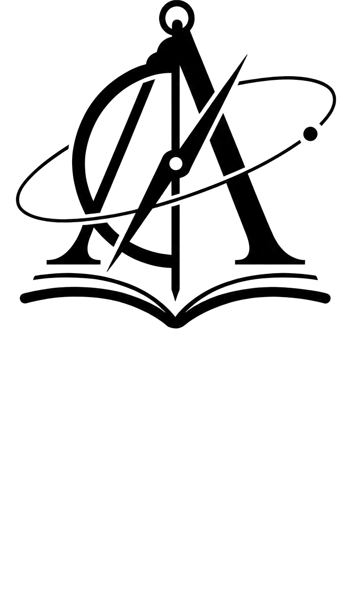

# Ars  Astronomica

A scholarly imprint producing first English translations of historical Hebrew and Latin works in astronomy, cosmology, and natural philosophy.

These texts span centuries, and most have never appeared in English. One -- Gersonides' 136-chapter mathematical astronomy -- was never printed and survives only in manuscript. They cite and answer one another, addressing the same cosmological questions, yet until now no one could read them side by side in a single language.

**[Browse the corpus](#the-corpus)** -- 38 works, each with a page of its own.

## About the translations

Every text is translated in full into fluent modern English -- nothing dropped, summarized, or invented -- with technical vocabulary anchored to its modern equivalents and mathematical content reproduced cell by cell and degree by degree. The PDFs are prepublication texts; the diagrams are still in progress.

These are **reading-grade** editions: complete and accurate in substance, good enough to work from and to read for pleasure, but not yet line-by-line verified against the printed page to the standard a scholar should cite. Quality is measured rather than asserted -- about one defect per thousand words on good Latin print, and some nine thousand numerals verified across Clavius's tables with essentially no misreadings.

[Read more about how the translations are made](https://arsastronomica.com/about/).

## Updates

**2026-08-07**

- Added Pedro Nunes's *Opera* (Coimbra, 1573) — the collected Latin works of the royal cosmographer of Portugal and the leading mathematician of the age of discoveries, in the author's own final edition: the two books on the art and science of navigation, the annotations on Peurbach's planetary theory and on Aristotle's mechanical problem of the rowed ship, the critique of Oronce Finé, and the treatise on twilight with Alhazen's book on its causes.
- The rest of the corpus has been reissued. A pass of mechanical edits brought the English into a more consistent modern register — many fixes of archaic wording and grammar, smoothing constructions that had come through the translation reading stiffly — without altering the sense of the text.

**2026-08-04**

- Added *Be'er HaGolah* (R. Judah Loew ben Bezalel, the Maharal of Prague, 1598) — his defense of the Aggadah, the non-legal portions of the Talmud, against the critics of his age who read its stories as absurd and its science as discredited.

**2026-07-31**

- Added two works: Clavius's *Opera Mathematica*, Tomus V — his own account of the Gregorian calendar reform he principally engineered — and Willebrord Snellius's *Eratosthenes Batavus* (Leiden, 1617), the first modern measurement of the Earth's circumference by triangulation.
- Every work has been reissued. Greek passages quoted inside the Latin texts were audited page by page and corrected throughout, and some editorial scaffolding that had been showing through into the reading text has been cleaned out.

[Earlier updates](https://arsastronomica.com/updates/)

## Support this project

> Upright reason dictates that the recipients of the good, of whatever type and level of beneficence it may be, must show gratitude and blessing to the beneficent person in every way possible, commensurate with the value of the beneficence. And one who has benefited all the people of the world -- for example, one who invented a new instrument for the good of the world, or a good book -- it is fitting for every discerning person, out of the obligation of love of fellow beings, to at least purchase it, so that the man will profit and his heart will be encouraged thereby to invent yet more good instruments in the world. And similarly, all other wise-hearted people will likewise strive and exert themselves to invent good things and instruments needed for the repair of the world and its perfection.
>
> And therefore, whoever says: "What do I need this new instrument for?" -- he does not act well towards the world. For if not for the man who invented it, where would you be? And what would your city do? And more than this, if the man did not exert himself, what would the world do?

R. Pinchas Eliyahu Hurwitz, _Sefer HaBris_

If you find these translations useful, you can [support me on Ko-fi](https://ko-fi.com/arsastronomica).

## Contact

- Email: **ArsAstronomica@protonmail.com**
- X: [@ArsAstronomica](https://x.com/ArsAstronomica)

## The corpus

| Date | Author | Work | Source | Description | Translator Version |
| -------- | ---------------------------- | -------------------------------------------------------------------------------------------------------------------------------------------------------------------------------------------------- | ----------------------------------------------------------------------------------------- | --------------------------------------------------------------------------------------------------------------------------------------------------------------------------------------------------------------- | ------------------ |
| 1665 | Athanasius Kircher | [*Mundus Subterraneus*](/works/athanasius-kircher-mundus-subterraneus/) [PDF](https://books.arsastronomica.com/Athanasius_Kircher_Mundus_Subterraneus.pdf) · [footnotes](https://books.arsastronomica.com/Athanasius_Kircher_Mundus_Subterraneus_Footnotes.pdf) | [Internet Archive — athanasiikircher12kirc](https://archive.org/details/athanasiikircher12kirc) | A vast attempt to explain the whole hidden world beneath our feet. | 2 |
| c. 1613 | David Gans | [*Nechmad ve-Na'im*](/works/david-gans-nechmad-ve-naim/) [PDF](https://books.arsastronomica.com/David_Gans_Nechmad_ve-Naim.pdf) · [footnotes](https://books.arsastronomica.com/David_Gans_Nechmad_ve-Naim_Footnotes.pdf) | National Library of Israel — Rosetta IE32709375, shelfmark 35 V 1770 catalog NNL_ALEPH990011964030205171 | A Hebrew textbook of astronomy that presents the Ptolemaic model of the heavens for a Hebrew-reading audience, weaving the cutting-edge European science of its day together with the medieval Jewish cosmological tradition — its author having personally visited the Danish astronomer Tycho Brahe. | 2 |
| 1592 (first composed/printed Prague, שנ"ב; this is a later reprint) | David Gans | [*Tzemach David*](/works/david-gans-tzemach-david/) [PDF](https://books.arsastronomica.com/David_Gans_Tzemach_David.pdf) · [footnotes](https://books.arsastronomica.com/David_Gans_Tzemach_David_Footnotes.pdf) | National Library of Israel — Rosetta IE90688593 record labeled "Vol.1-3" | A Hebrew historical chronicle in two parts by David Gans: the first traces Jewish history from creation to the sixteenth century — biblical figures, sages, and rabbis; the second surveys world and gentile history from Julius Caesar to Emperor Rudolph. | 2 |
| 1665 | Giovanni Battista Riccioli | [*Astronomia Reformata*](/works/giovanni-battista-riccioli-astronomia-reformata/) [PDF](https://books.arsastronomica.com/Giovanni_Battista_Riccioli_Astronomia_Reformata.pdf) · [footnotes](https://books.arsastronomica.com/Giovanni_Battista_Riccioli_Astronomia_Reformata_Footnotes.pdf) | [e-rara ETH-Bibliothek Zürich — title-info 141744](https://www.e-rara.ch/zut/content/titleinfo/141744) | A mature reckoning with the heavens as the telescope was revealing them — a sequel to the vast *Almagestum Novum* (1651), built on further years of observation at Bologna with the collaborator Grimaldi, with fresh measurements and corrected parameters at center stage. | 2 |
| 1611 | Christoph Clavius | [*Opera Mathematica, Tomus Primus (Euclid, Theodosius, trigonometry)*](/works/christoph-clavius-opera-mathematica-tomus-primus/) [PDF](https://books.arsastronomica.com/Christoph_Clavius_Opera_Mathematica_Tomus_Primus.pdf) · [footnotes](https://books.arsastronomica.com/Christoph_Clavius_Opera_Mathematica_Tomus_Primus_Footnotes.pdf) | [Bayerische Staatsbibliothek / MDZ — bsb10496544](https://www.digitale-sammlungen.de/en/view/bsb10496544) | Tomus I of Clavius's collected mathematical works gathers his geometry and trigonometry. | 2 |
| 1611 | Christoph Clavius | [*Opera Mathematica, Tomus Secundus (practical geometry, arithmetic, algebra)*](/works/christoph-clavius-opera-mathematica-tomus-secundus/) [PDF](https://books.arsastronomica.com/Christoph_Clavius_Opera_Mathematica_Tomus_Secundus.pdf) · [footnotes](https://books.arsastronomica.com/Christoph_Clavius_Opera_Mathematica_Tomus_Secundus_Footnotes.pdf) | [Bayerische Staatsbibliothek / MDZ — bsb10496545](https://www.digitale-sammlungen.de/en/view/bsb10496545) | Tomus II collects Clavius's practical mathematics. | 2 |
| 1611 | Christoph Clavius | [*Opera Mathematica, Tomus Tertius (Sacrobosco's Sphere, astrolabe)*](/works/christoph-clavius-opera-mathematica-tomus-tertius/) [PDF](https://books.arsastronomica.com/Christoph_Clavius_Opera_Mathematica_Tomus_Tertius.pdf) · [footnotes](https://books.arsastronomica.com/Christoph_Clavius_Opera_Mathematica_Tomus_Tertius_Footnotes.pdf) | [Bayerische Staatsbibliothek / MDZ — bsb10496546](https://www.digitale-sammlungen.de/en/view/bsb10496546) | Tomus III holds Clavius's astronomy. | 2 |
| 1612 | Christoph Clavius | [*Opera Mathematica, Tomus Quartus (Gnomonice)*](/works/christoph-clavius-opera-mathematica-tomus-quartus/) [PDF](https://books.arsastronomica.com/Christoph_Clavius_Opera_Mathematica_Tomus_Quartus.pdf) · [footnotes](https://books.arsastronomica.com/Christoph_Clavius_Opera_Mathematica_Tomus_Quartus_Footnotes.pdf) | [Bayerische Staatsbibliothek / MDZ — bsb10496547](https://www.digitale-sammlungen.de/en/view/bsb10496547) | Tomus IV is Clavius's *Gnomonices* — the most exhaustive Renaissance treatise on gnomonics, the science of sundials and shadow-casting. | 2 |
| 1612 | Christoph Clavius | [*Opera Mathematica, Tomus Quintus (Gregorian calendar reform)*](/works/christoph-clavius-opera-mathematica-tomus-quintus/) [PDF](https://books.arsastronomica.com/Christoph_Clavius_Opera_Mathematica_Tomus_Quintus.pdf) · [footnotes](https://books.arsastronomica.com/Christoph_Clavius_Opera_Mathematica_Tomus_Quintus_Footnotes.pdf) | [Bayerische Staatsbibliothek / MDZ — bsb10496548](https://www.digitale-sammlungen.de/en/view/bsb10496548) | Tomus V is Clavius's definitive account of the Gregorian calendar reform, which he principally engineered. | 2 |
| 1617 | Christoph Scheiner | [*Refractiones Coelestes*](/works/christoph-scheiner-refractiones-coelestes/) [PDF](https://books.arsastronomica.com/Christoph_Scheiner_Refractiones_Coelestes.pdf) · [footnotes](https://books.arsastronomica.com/Christoph_Scheiner_Refractiones_Coelestes_Footnotes.pdf) | [Universitätsbibliothek Freiburg — *diglit* `scheiner1617`](https://dl.ub.uni-freiburg.de/diglit/scheiner1617) | *Refractiones coelestes* addresses atmospheric refraction and the apparent elliptical — vertically flattened — shape of the Sun near the horizon. | 2 |
| 1630 | Christoph Scheiner | [*Rosa Ursina sive Sol*](/works/christoph-scheiner-rosa-ursina-sive-sol/) [PDF](https://books.arsastronomica.com/Christoph_Scheiner_Rosa_Ursina_sive_Sol.pdf) · [footnotes](https://books.arsastronomica.com/Christoph_Scheiner_Rosa_Ursina_sive_Sol_Footnotes.pdf) | [Bayerische Staatsbibliothek / MDZ — bsb11348805](https://www.digitale-sammlungen.de/en/view/bsb11348805) | *Rosa Ursina* is the first comprehensive treatise on sunspots and a foundational work of telescopic solar astronomy. | 2 |
| c. 1123 (composition; this is a later manuscript copy) | Jacob ben Samson (attrib.) | [*Perush Sod ha-Ibbur*](/works/jacob-ben-samson-perush-sod-ha-ibbur/) [PDF](https://books.arsastronomica.com/Jacob_ben_Samson_attrib_Perush_Sod_ha-Ibbur.pdf) · [footnotes](https://books.arsastronomica.com/Jacob_ben_Samson_attrib_Perush_Sod_ha-Ibbur_Footnotes.pdf) | [OPenn UPenn-hosted digitization of the British Library manuscript — British Library Add MS 11639, ff. 511r–545v](https://openn.library.upenn.edu/Data/0047/) | An early Ashkenazi commentary on the "secret of the calendar" (*sod ha-ibbur*) — the computation of the Hebrew calendar: the molad (lunar conjunction), the tequfot (seasonal points), the nineteen-year intercalation cycle, and the rules governing leap years and festival dates. | 2 |
| 1629 | Joseph Solomon Delmedigo | [*Sefer Elim*](/works/joseph-solomon-delmedigo-sefer-elim/) [PDF](https://books.arsastronomica.com/Joseph_Solomon_Delmedigo_Sefer_Elim.pdf) · [footnotes](https://books.arsastronomica.com/Joseph_Solomon_Delmedigo_Sefer_Elim_Footnotes.pdf) | [Internet Archive — seferelim00delmuoft](https://archive.org/details/seferelim00delmuoft) | A wide-ranging Hebrew scientific compendium, framed as a reply to questions put by the Karaite scholar Zerah ben Nathan. | 2 |
| 1640 | Longomontanus | [*Astronomia Danica*](/works/longomontanus-astronomia-danica/) [PDF](https://books.arsastronomica.com/Longomontanus_Astronomia_Danica.pdf) · [footnotes](https://books.arsastronomica.com/Longomontanus_Astronomia_Danica_Footnotes.pdf) | [Internet Archive — astronomiadanica00long](https://archive.org/details/astronomiadanica00long) | A comprehensive textbook of astronomy and the definitive technical account of the Tychonic system — Earth at rest, the Sun circling it, the planets circling the Sun. | 2 |
| 1573 | Pedro Nunes | [*Opera (Coimbra, 1573)*](/works/pedro-nunes-opera/) [PDF](https://books.arsastronomica.com/Pedro_Nunes_Opera.pdf) · [footnotes](https://books.arsastronomica.com/Pedro_Nunes_Opera_Footnotes.pdf) | [Internet Archive — `bub_gb_N7WJTq-MwDQC`](https://archive.org/details/bub_gb_N7WJTq-MwDQC) | The collected Latin works of Pedro Nunes, royal cosmographer of Portugal and the leading mathematician of the age of discoveries, in the author's own final edition. | 2 |
| 1654 | Pierre Gassendi | [*Tychonis Brahei Vita*](/works/pierre-gassendi-tychonis-brahei-vita/) [PDF](https://books.arsastronomica.com/Pierre_Gassendi_Tychonis_Brahei_Vita.pdf) · [footnotes](https://books.arsastronomica.com/Pierre_Gassendi_Tychonis_Brahei_Vita_Footnotes.pdf) | [Internet Archive — den-kbd-pil-130018157889-001](https://archive.org/details/den-kbd-pil-130018157889-001) | A life of the Danish astronomer Tycho Brahe (1546–1601): his fabled observatory on the island of Hven, the magnificent instruments he built, the campaigns of observation that remade astronomy, his bold model of the cosmos, and his turbulent final years in Prague. | 2 |
| c. 1136 | R. Avraham bar Ḥiyya ha-Nasi | [*Cheshbon Mahalechot ha-Kochavim*](/works/avraham-bar-hiyya-ha-nasi-cheshbon-mahalechot-ha-kochavim/) [PDF](https://books.arsastronomica.com/Avraham_bar_Hiyya_ha-Nasi_Cheshbon_Mahalechot_ha-Kochavim.pdf) · [footnotes](https://books.arsastronomica.com/Avraham_bar_Hiyya_ha-Nasi_Cheshbon_Mahalechot_ha-Kochavim_Footnotes.pdf) | [HebrewBooks.org — ID 22072](https://hebrewbooks.org/22072) | A medieval Hebrew treatise on mathematical astronomy and the computation of the Jewish calendar. | 2 |
| c. 1122 | R. Avraham bar Ḥiyya ha-Nasi | [*Sefer HaIbbur*](/works/avraham-bar-hiyya-ha-nasi-sefer-haibbur/) [PDF](https://books.arsastronomica.com/Avraham_bar_Hiyya_ha-Nasi_Sefer_HaIbbur.pdf) · [footnotes](https://books.arsastronomica.com/Avraham_bar_Hiyya_ha-Nasi_Sefer_HaIbbur_Footnotes.pdf) | [HebrewBooks.org — ID 21292](https://hebrewbooks.org/21292) | The earliest systematic Hebrew treatise on the science of the calendar, written in early-twelfth-century Barcelona. | 2 |
| c. 1132 | R. Avraham bar Ḥiyya ha-Nasi | [*Sefer Tsurat ha-Arets*](/works/avraham-bar-hiyya-ha-nasi-sefer-tsurat-ha-arets/) [PDF](https://books.arsastronomica.com/Avraham_bar_Hiyya_ha-Nasi_Sefer_Tsurat_ha-Arets.pdf) · [footnotes](https://books.arsastronomica.com/Avraham_bar_Hiyya_ha-Nasi_Sefer_Tsurat_ha-Arets_Footnotes.pdf) | [NYPL Digital Collections Dorot Jewish Division — item ce668260-c766-0132-045a-58d385a7b928](https://digitalcollections.nypl.org/items/ce668260-c766-0132-045a-58d385a7b928) | A foundational work of medieval cosmology that lays out the shape of the cosmos as the Greeks and their Arabic heirs understood it: a spherical earth at the center of nested celestial spheres, the paths of sun and moon, and the zones and geography of the inhabited world. | 2 |
| c. 1148 | R. Avraham ibn Ezra | [*Keli ha-Nechoshet*](/works/avraham-ibn-ezra-keli-ha-nechoshet/) [PDF](https://books.arsastronomica.com/Avraham_ibn_Ezra_Keli_ha-Nechoshet.pdf) · [footnotes](https://books.arsastronomica.com/Avraham_ibn_Ezra_Keli_ha-Nechoshet_Footnotes.pdf) | [HebrewBooks.org — ID 20850](https://hebrewbooks.org/20850) | The earliest surviving Hebrew treatise on the astrolabe, composed in the mid-twelfth century. | 2 |
| c. 1500 | R. Eliyahu Mizrahi | [*Kitsur ha-Melakhat ha-Mispar*](/works/eliyahu-mizrahi-kitsur-ha-melakhat-ha-mispar/) [PDF](https://books.arsastronomica.com/Eliyahu_Mizrahi_Kitsur_ha-Melakhat_ha-Mispar.pdf) · [footnotes](https://books.arsastronomica.com/Eliyahu_Mizrahi_Kitsur_ha-Melakhat_ha-Mispar_Footnotes.pdf) | [NYPL Digital Collections Dorot Jewish Division — item ce668260-c766-0132-045a-58d385a7b928](https://digitalcollections.nypl.org/items/ce668260-c766-0132-045a-58d385a7b928) | Kitsur ha-Melakhat ha-Mispar ("Compendium of the Art of Number") is a Hebrew arithmetic textbook by Rabbi Eliyahu Mizrahi (ca. 1455–1526), the chief rabbi of the Ottoman Empire and one of the foremost Jewish mathematicians of his age. | 2 |
| c. 1365 | R. Immanuel Bonfils | [*Shesh Kenafayim*](/works/immanuel-bonfils-shesh-kenafayim/) [PDF](https://books.arsastronomica.com/Immanuel_Bonfils_Shesh_Kenafayim.pdf) · [footnotes](https://books.arsastronomica.com/Immanuel_Bonfils_Shesh_Kenafayim_Footnotes.pdf) | [University of Pennsylvania — Kislak Center, LJS 204 Digital Scriptorium DS129](https://search.digital-scriptorium.org/catalog/DS129) | One of the most widely copied Hebrew astronomical handbooks of the late Middle Ages, composed around 1365 in Provence. | 2 |
| late 14th c. (composition; this is a later manuscript copy) | R. Isaac ibn al-Aḥdab | [*Keli Ḥemda*](/works/isaac-ibn-al-ahdab-keli-hemda/) [PDF](https://books.arsastronomica.com/Isaac_ibn_al-Ahdab_Keli_Hemda.pdf) · [footnotes](https://books.arsastronomica.com/Isaac_ibn_al-Ahdab_Keli_Hemda_Footnotes.pdf) | [Gallica / BnF — Hébreu 1031, ff. 208r–215v](https://gallica.bnf.fr/ark:/12148/btv1b10539303j) | Isaac ibn al-Aḥdab's *Keli Ḥemda* ("The Precious Instrument") — a description of the construction and use of an equatorium, an instrument for computing planetary positions geometrically. | 2 |
| c. 1396 (composed in Syracuse, Sicily; this is a later manuscript copy) | R. Isaac ibn al-Aḥdab | [*Orah Selulah*](/works/isaac-ibn-al-ahdab-orah-selulah/) [PDF](https://books.arsastronomica.com/Isaac_ibn_al-Ahdab_Orah_Selulah.pdf) · [footnotes](https://books.arsastronomica.com/Isaac_ibn_al-Ahdab_Orah_Selulah_Footnotes.pdf) | [Gallica / BnF — Hébreu 1086](https://gallica.bnf.fr/ark:/12148/btv1b105395090) | A set of astronomical tables by Isaac ibn al-Ahdab (Sicily, late 14th c.) for computing the true conjunctions and oppositions of the Sun and Moon — the *Orah Selulah* ("Paved Way"), one of the most widely copied Hebrew astronomical table-works (surviving in ~25 manuscripts). | 2 |
| c. 1288 (composition; this is a later manuscript copy) | R. Jacob ben Machir ibn Tibbon | [*Roba' Yisrael*](/works/jacob-ben-machir-ibn-tibbon-roba-yisrael/) [PDF](https://books.arsastronomica.com/Jacob_ben_Machir_ibn_Tibbon_Roba_Yisrael.pdf) · [footnotes](https://books.arsastronomica.com/Jacob_ben_Machir_ibn_Tibbon_Roba_Yisrael_Footnotes.pdf) | [Gallica / BnF — Hébreu 1031, ff. 131r–147v](https://gallica.bnf.fr/ark:/12148/btv1b10539303j) | Jacob ben Machir ibn Tibbon's treatise on the *quadrans novus* — the improved astronomical quadrant of his own invention — describing how the instrument is constructed and used for astronomical and time-keeping measurements. | 2 |
| c. 1247 (Hebrew self-translation from the author's earlier Arabic; this is a 14th-c. manuscript copy) | R. Judah ben Solomon ha-Kohen | [*Midrash ha-Ḥokhmah*](/works/judah-ben-solomon-ha-kohen-midrash-ha-hokhmah/) [PDF](https://books.arsastronomica.com/Judah_ben_Solomon_ha-Kohen_Midrash_ha-Hokhmah.pdf) · [footnotes](https://books.arsastronomica.com/Judah_ben_Solomon_ha-Kohen_Midrash_ha-Hokhmah_Footnotes.pdf) | [NLI Ktiv Palatina partner collection — DocId PNX_MANUSCRIPTS990000837360205171-1](https://iiif.nli.org.il/IIIFv21/990000837360205171/manifest) | The first scientific encyclopedia written in Hebrew. | 2 |
| 1598 | R. Judah Loew ben Bezalel (Maharal) | [*Be'er HaGolah*](/works/judah-loew-ben-bezalel-beer-hagolah/) [PDF](https://books.arsastronomica.com/Judah_Loew_ben_Bezalel_Beer_HaGolah.pdf) · [footnotes](https://books.arsastronomica.com/Judah_Loew_ben_Bezalel_Beer_HaGolah_Footnotes.pdf) | [Sefaria — Be'er HaGolah](https://www.sefaria.org/Be%27er_HaGolah) | Maharal's defense of the Aggadah — the non-legal portions of the Talmud — against the critics of his age, who read its stories as absurd, its science as discredited, and its authors as credulous. | 2 |
| c. 1329 | R. Levi ben Gershom | [*Milchamot HaShem*](/works/levi-ben-gershom-milchamot-hashem/) [PDF](https://books.arsastronomica.com/Levi_ben_Gershom_Milchamot_HaShem.pdf) · [footnotes](https://books.arsastronomica.com/Levi_ben_Gershom_Milchamot_HaShem_Footnotes.pdf) | [Internet Archive — sefermilamothash00leviuoft](https://archive.org/details/sefermilamothash00leviuoft) | The Wars of the Lord is the philosophical and theological masterwork of Levi ben Gershom (Gersonides, 1288–1344), one of the boldest minds of medieval Provence. | 2 |
| c. 1328 | R. Levi ben Gershom | [*Sefer HaTechunah*](/works/levi-ben-gershom-sefer-hatechunah/) [PDF](https://books.arsastronomica.com/Levi_ben_Gershom_Sefer_HaTechunah.pdf) · [footnotes](https://books.arsastronomica.com/Levi_ben_Gershom_Sefer_HaTechunah_Footnotes.pdf) | [Gallica / BnF — MS Hébreu 724, ff. 1r–257v](https://gallica.bnf.fr/ark:/12148/btv1b10544205n) | A complete medieval system of mathematical astronomy, formally Book V, Part 1 of the *Wars of the Lord*. | 2 |
| 15th c. (composition; this is a later manuscript copy) | R. Mordecai Comtino | [*Sefer ha-Ḥeshbon ve-ha-Middot*](/works/mordecai-comtino-sefer-ha-heshbon-ve-ha-middot/) [PDF](https://books.arsastronomica.com/Mordecai_Comtino_Sefer_ha-Heshbon_ve-ha-Middot.pdf) · [footnotes](https://books.arsastronomica.com/Mordecai_Comtino_Sefer_ha-Heshbon_ve-ha-Middot_Footnotes.pdf) | [Gallica / BnF — Hébreu 1031, ff. 26r–65r](https://gallica.bnf.fr/ark:/12148/btv1b10539303j) | An instructional treatise on arithmetic and practical geometry by Mordecai ben Eliezer Comtino (Constantinople, 15th c.), one of the leading Rabbanite scholars of Byzantine Jewry. | 2 |
| 1797 | R. Pinchas Eliyahu Hurwitz | [*Sefer HaBris HaShalem*](/works/pinchas-eliyahu-hurwitz-sefer-habris-hashalem/) [PDF](https://books.arsastronomica.com/Pinchas_Eliyahu_Hurwitz_Sefer_HaBris_HaShalem.pdf) · [footnotes](https://books.arsastronomica.com/Pinchas_Eliyahu_Hurwitz_Sefer_HaBris_HaShalem_Footnotes.pdf) | [HebrewBooks.org — ID 43670](https://hebrewbooks.org/43670) | A sweeping Hebrew encyclopedia of science and mysticism, among the most widely read Hebrew books of its era. | 2 |
| c. 1310 | R. Yitzchak Yisraeli | [*Yesod Olam*](/works/yitzchak-yisraeli-yesod-olam/) [PDF](https://books.arsastronomica.com/Yitzchak_Yisraeli_Yesod_Olam.pdf) · [footnotes](https://books.arsastronomica.com/Yitzchak_Yisraeli_Yesod_Olam_Footnotes.pdf) | [Digital Bodleian — MS. Huntington 299](https://digital.bodleian.ox.ac.uk/objects/aa14af19-443e-4f76-99da-7f3a4cd067a0/) | One of the great medieval Hebrew treatises on astronomy and the science of the Jewish calendar, composed in Toledo in the first half of the fourteenth century. | 2 |
| 1602 | Tycho Brahe | [*Astronomiae Instauratae Mechanica*](/works/tycho-brahe-astronomiae-instauratae-mechanica/) [PDF](https://books.arsastronomica.com/Tycho_Brahe_Astronomiae_Instauratae_Mechanica.pdf) · [footnotes](https://books.arsastronomica.com/Tycho_Brahe_Astronomiae_Instauratae_Mechanica_Footnotes.pdf) | [Internet Archive — gri_tychonisbrah00brah](https://archive.org/details/gri_tychonisbrah00brah) | A sumptuously illustrated catalog of the most accurate astronomical instruments built before the telescope, gathered on the island observatory of Hven. | 2 |
| 1610 | Tycho Brahe | [*Astronomiae Instauratae Progymnasmata*](/works/tycho-brahe-astronomiae-instauratae-progymnasmata/) [PDF](https://books.arsastronomica.com/Tycho_Brahe_Astronomiae_Instauratae_Progymnasmata.pdf) · [footnotes](https://books.arsastronomica.com/Tycho_Brahe_Astronomiae_Instauratae_Progymnasmata_Footnotes.pdf) | [e-rara ETH-Bibliothek Zürich — Rar 4153 DOI 10.3931/e-rara-315, object ID 84169](https://www.e-rara.ch/zut/doi/10.3931/e-rara-315) | The fullest statement of the observational program that transformed the science of the heavens. | 2 |
| 1588 | Tycho Brahe | [*De Mundi Aetherei Recentioribus Phaenomenis*](/works/tycho-brahe-de-mundi-aetherei-recentioribus-phaenomenis/) [PDF](https://books.arsastronomica.com/Tycho_Brahe_De_Mundi_Aetherei_Recentioribus_Phaenomenis.pdf) · [footnotes](https://books.arsastronomica.com/Tycho_Brahe_De_Mundi_Aetherei_Recentioribus_Phaenomenis_Footnotes.pdf) | [Internet Archive — bub_gb_2f-EqKxRN34C](https://archive.org/details/bub_gb_2f-EqKxRN34C) | When a brilliant comet blazed across Europe in 1577, the finest instruments of the age were turned upon it, and the measurements shattered the ancient belief in unchanging, perfect heavens: the comet moved freely where solid crystalline spheres were supposed to be. | 2 |
| 1596 | Tycho Brahe | [*Epistolarum Astronomicarum Libri*](/works/tycho-brahe-epistolarum-astronomicarum-libri/) [PDF](https://books.arsastronomica.com/Tycho_Brahe_Epistolarum_Astronomicarum_Libri.pdf) · [footnotes](https://books.arsastronomica.com/Tycho_Brahe_Epistolarum_Astronomicarum_Libri_Footnotes.pdf) | [Internet Archive — tychonisbrahedan00brah](https://archive.org/details/tychonisbrahedan00brah) | Before scientific journals existed, astronomers argued, boasted, and traded discoveries by letter. | 2 |
| c. 150–850 CE | Unknown | [*Mishnat ha-Middot*](/works/unknown-mishnat-ha-middot/) [PDF](https://books.arsastronomica.com/Unknown_Mishnat_ha-Middot.pdf) · [footnotes](https://books.arsastronomica.com/Unknown_Mishnat_ha-Middot_Footnotes.pdf) | [HebrewBooks.org — ID 39044](https://hebrewbooks.org/39044) | The earliest known Hebrew treatise on geometry — a concise practical manual of mensuration covering the areas and perimeters of plane figures, the measurement of circles and segments, and an early value for π. | 2 |
| 1617 | Willebrord Snellius | [*Eratosthenes Batavus*](/works/willebrord-snellius-eratosthenes-batavus/) [PDF](https://books.arsastronomica.com/Willebrord_Snellius_Eratosthenes_Batavus.pdf) · [footnotes](https://books.arsastronomica.com/Willebrord_Snellius_Eratosthenes_Batavus_Footnotes.pdf) | [e-rara / ETH-Bibliothek Zürich, Rar 4426](https://www.e-rara.ch/zut/doi/10.3931/e-rara-2205) | The founding text of modern geodesy. | 2 |

## License

The original works are in the public domain and were obtained from a variety of sources, including digitized library collections and other open archives. No claim of ownership is made over the source texts.

All translations in this collection are © Scott Weisman. All rights reserved, except as granted by the license below.

The translations are made available under the [Creative Commons Attribution-NonCommercial-NoDerivatives 4.0 International](https://creativecommons.org/licenses/by-nc-nd/4.0/) license. You are free to share them for non-commercial purposes with attribution; you may not modify them or use them commercially without prior written permission.

## Acknowledgements

Translated with the assistance of Claude. The translator thanks the [Anthropic](https://www.anthropic.com) team for making this work possible.
